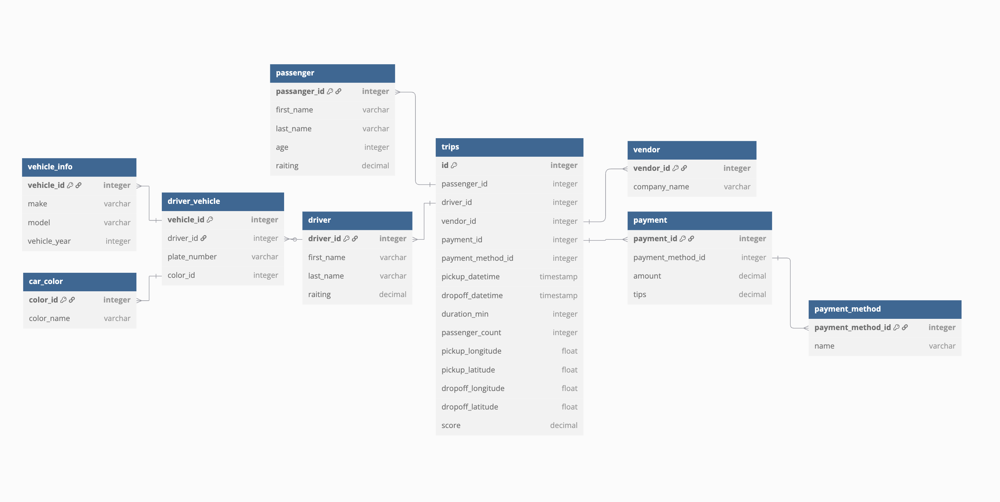

# Project: dwh-taxi-sandbox

This project simulates a full analytical data warehouse based on NYC taxi trip data.  
The source dataset is extended with synthetic dimensions to support a fully normalized snowflake schema, structured for educational and prototyping purposes.

- Storage: relational SQL database (ClickHouse)
- Orchestration: Apache Airflow
- Modeling: normalized to Third Normal Form (3NF)

## Schema

- ER Diagram: 
- Logical DBML: [`dwh_schema.dbml`](schema/dwh_schema.dbml)

## Tools & Setup

This project uses the following stack:

- **ClickHouse** — column-oriented database for storing normalized analytical data
- **Apache Airflow** — orchestrates data generation and ingestion
- **Python** — for synthetic data generation and reporting
- **Pandas** — for tabular analysis and CSV export
- **Faker** — for generating realistic names and values
- **python-dotenv** — for managing environment variables securely

### Prerequisites

### 1. Install Dependencies

```bash
pip install -r requirements.txt
```

### 2. Start ClickHouse and Airflow (via Docker)

Start the infrastructure using Docker. You can either use your own `docker-compose.yml` file,  
or run the containers manually and mount the necessary volumes.

- ClickHouse should expose port `8123` (HTTP interface).
- Airflow must have access to the DAG and all support scripts listed below.

```text
Ensure the following files are located in the Airflow DAGs directory:

airflow/
├── dags/
│   ├── DAG_trip_generation_15min.py
│   ├── New_trips_generation.py
│   ├── Generation_func.py
│   └── car_info.py
```


## Pipeline Overview

This section describes the full lifecycle of data flow in the project, from data generation to storage and reporting.


1. **Synthetic data generation**  
   The pipeline begins with a real-world dataset from Kaggle:  
   [NYC Taxi Trip Duration](https://www.kaggle.com/datasets/yasserh/nyc-taxi-trip-duration).  
   This dataset contains 11 basic columns describing taxi trips.

   At this stage, we enrich it with additional synthetic data about:
   - passengers (e.g. names, ages, ratings),
   - drivers,
   - payment details,
   - vehicles (make, model, year, etc.).

   This enrichment is performed using the script `Clean_and_stage_data.py`, which outputs 10 structured `.csv` files for downstream processing.
   
2. **Data normalization**  
   The resulting normalized datasets form the basis for our snowflake schema.

   

   - `synth.csv` contains the combined dataset with all extended fields in a denormalized format, primarily for testing or initial exploration.
   - The remaining `.csv` files represent normalized tables (e.g. `passenger_table.csv`, `driver_table.csv`, etc.) that form the snowflake schema and are ready to be loaded into ClickHouse.

   

3. **Storage in ClickHouse**  
   The database schema was first defined using a custom SQL script:  
   `clickhouse/create_tables.sql`, which creates all necessary dimension and fact tables  
   following a snowflake design.

   Once the tables were created, the normalized `.csv` files were imported manually  
   using the **DBeaver** interface.

   The database now contains a snowflake schema under the `analytics` database, including the following tables:

    - `car_color`
    - `driver_table`
    - `driver_vehicle`
    - `passenger_table`
    - `payment`
    - `payment_method`
    - `trips_table` (fact table)
    - `vehicle_info`
    - `vendor`

   
   
   

4. **Orchestration with Airflow**  
   A custom Airflow DAG named `DAG_trip_generation_15min.py` is used to simulate real-time trip ingestion.  
   The DAG runs every 15 minutes and inserts a **single new trip** into the data warehouse.

   Each new trip is generated using a Python-based logic defined in `New_trips_generation.py`.  
   The DAG is implemented using a single `PythonOperator` task.

   During execution, a new trip is created with either:
   - existing passengers and drivers already present in the database, or
   - entirely new ones, in which case the corresponding dimension tables (`passenger_table`, `driver_table`, etc.) are also updated.

   This design allows the system to mimic realistic incremental growth over time.

   All information about the inserted trip — including IDs and duration — is logged and can be viewed in the Airflow task logs.

   

5. **Reporting and analysis**  
   The script `dwh_analytics_report.py` contains a set of analytical SQL queries used to explore and validate the data warehouse contents.

   These queries are executed against the current live state of the ClickHouse database.  
   Inside the script, queries are stored in a dictionary called `queries`, which can be easily extended with new custom requests.

   For each query, the script:
   - runs the SQL against ClickHouse using `clickhouse-connect`,
   - captures the results in a pandas DataFrame,
   - and exports the output to a `.csv` file.

   All generated reports are saved to the `clickhouse/reports/` directory for further inspection.

   